**ARCHIVING RESEARCH HUB SYSTEM FOR SENIOR HIGH SCHOOL STUDENTS IN IBAAN SAINT JAMES ACADEMY, INC.**

FINAL PROJECT:  
IT 311 - System Administration and Maintenance  
IT 312 - System Integration and Architecture  
IT 313 - Sytem Analysis and Design  
IT 314 - Web Systems and Technologies  
BSIT - 3107   
Members:
1. Acosta, Hans Rafael B. | Member Grade: 20%   Reason: System and Web Design, and Data Entry  
2. De Castro, Mark Rafael V. | Member Grade: 32%    Reason: Back-End Development  
3. De Villa, Jefferson A. | Member Grade: 16%    Reason: Data Entry and Documentation  
4. Maralit, Chris Jerald G. | Member Grade: 32%    Reason: Front-End Development, Back-End Development and Documentation  

**Project Objective**  
General Objective  
To develop an archiving research hub architecture with the existing system of Ibaan Saint James Academy, Inc.   
Specific Objectives that aim to:  
• To establish core competencies of its personnel and stakeholders and to provide a feasible and efficient systematized process in the pursuit of quality education.  
• To collate previous physical manuscripts to turn into digital means of information.  
• To consolidate stored data for reliable resource allocation for future research purposes.   

**Project Summary** 
    The sole purpose of this project is to provide a dedicated space for students to view research documents, collaborate with other students and enhance their critical thinking, problem-solving, and analytical skills. Our goal is to encourage innovation and the exploration of diverse fields of study, empowering students to become lifelong learners and proactive contributors to the world of knowledge. Align with the SDG (Sustainable Development Goals) for this system, **SDG No.4 – Quality Education**. This is to ensure inclusive and equitable quality education and promote lifelong learning opportunities for all. On a broad perspective, all SDG’s can also be aligned for it supports all manuscripts involved in their practical research.

**Technologies Used**  
Software: Web Browsers: Google Chrome, Brave, and Opera GX   
IDE: Visual Studio Code (HTML, CSS, JavaScript and PHP)  
Back-End Server: XAMPP Server PHP MyAdmin   
Hardware: Desktop Computer, Laptop and peripherals  

To test the Admin Login:  
Admin Email Address: cjgm0920@gmail.com  
Password: MxLWAsKm1$

To test the Student Login:  
Student Email Address: markaldrinacebo@gmail.com  
Password: Coffeejelly1$  

**Student Homapage GUI**   
**Register Page**   
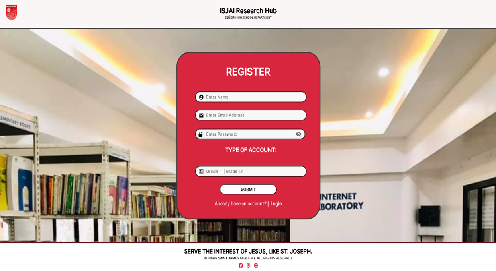   
**Student Login Page**   
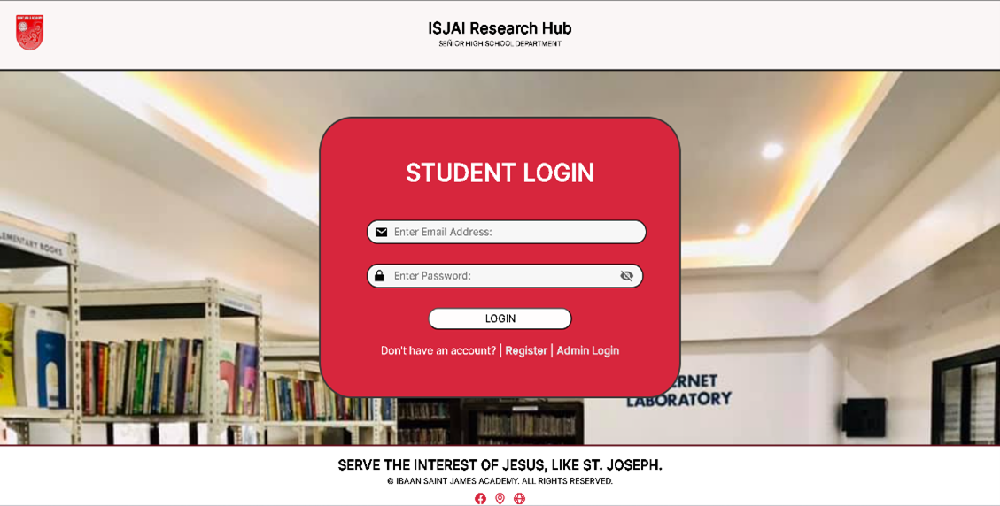   
**Main Dashboard**   
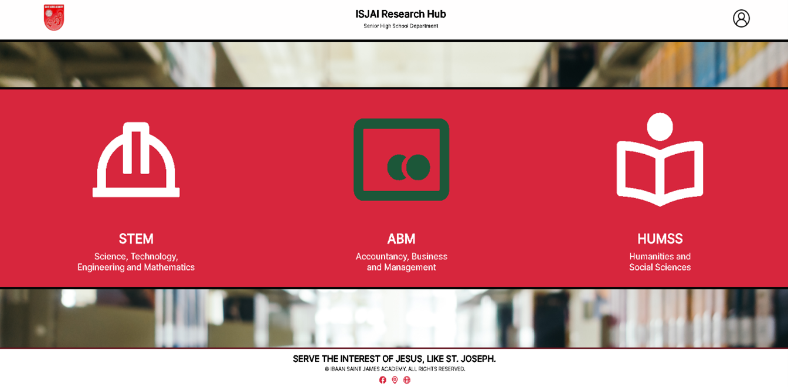   
**STEM Documents Page**   
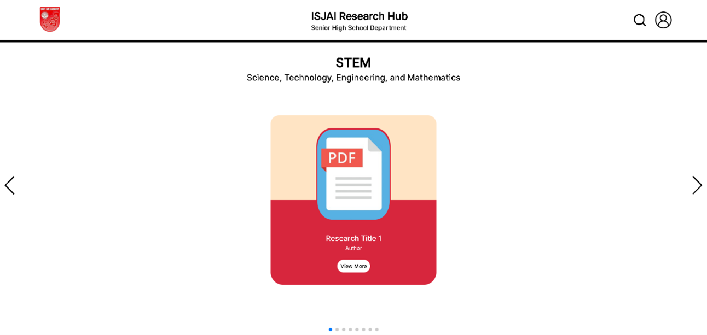   
**ABM Documents Page**   
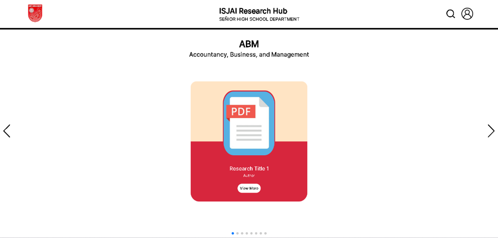   
**HUMSS Documents Page**  
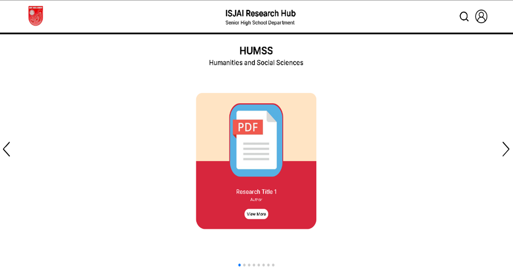   
**View Documents Page**   
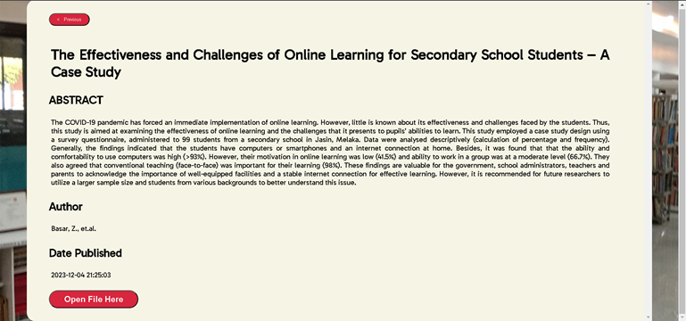   

**Admin Dashboard GUI**   
**Admin Login Page**   
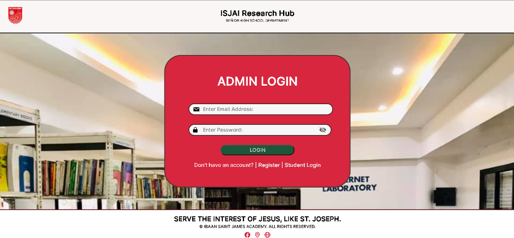   
**Student Records Dashboard**   
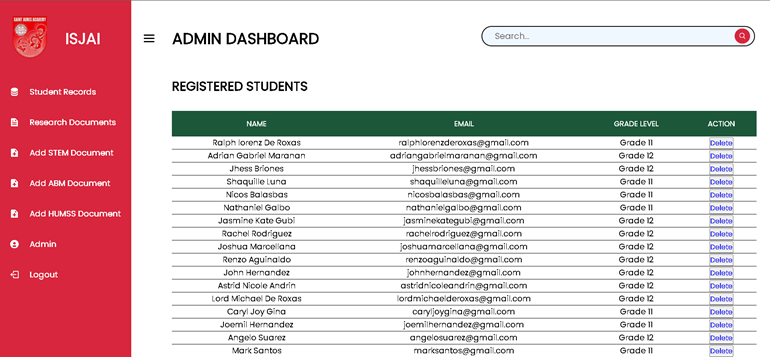   
**Research Records Dashboard**   
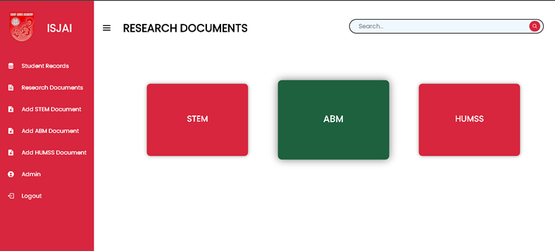   
**Research Strands/Categories Dashboard**   
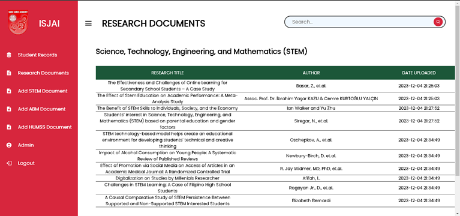   
**Add Documents Page**   
   

